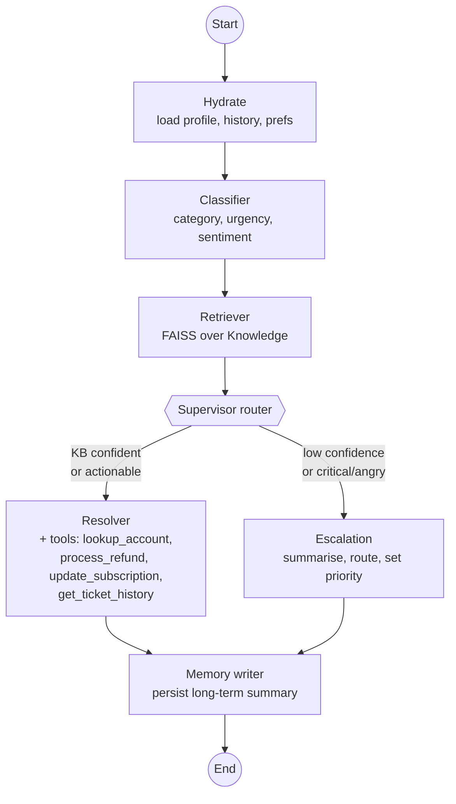

# UDA-Hub — Multi-Agent Architecture

UDA-Hub is a **Universal Decision Agent** that ingests support tickets, decides
how to handle each one, and either resolves it autonomously or escalates it to
a human. The system is built on **LangGraph** and follows the **Supervisor**
multi-agent pattern: a single orchestrator (the *Supervisor*, expressed as a
conditional edge plus a hydration node) drives a small team of specialised
agents that share state through a typed graph.

---

## 1. High-level diagram



ASCII fallback:

```
   START
     |
     v
 +---------+    +-----------+    +----------+
 | hydrate | -> | classifier| -> | retriever|
 +---------+    +-----------+    +----------+
                                       |
                              +--------+--------+
                              |  supervisor     |
                              |  router         |
                              +-----+-----------+
                                    |
                  +-----------------+-----------------+
                  | confident / actionable             | low conf / critical / angry
                  v                                    v
             +----------+                         +-----------+
             | resolver |                         | escalation|
             +----------+                         +-----------+
                  \                                   /
                   \                                 /
                    v                               v
                       +-----------------+
                       |  memory_writer  |
                       +--------+--------+
                                |
                                v
                              END
```

---

## 2. Agents and responsibilities

| Agent             | Responsibilities                                                                                     | Reads from state                                          | Writes to state                                              | Side effects (DB)                                                       |
|-------------------|------------------------------------------------------------------------------------------------------|-----------------------------------------------------------|--------------------------------------------------------------|-------------------------------------------------------------------------|
| **Hydrate**       | Load `User`/`Account` profile, prior `Ticket` history, customer preferences from long-term memory.   | `user_id`, `ticket_id`                                    | `customer_profile`, `customer_history`, `customer_preferences` | Inserts a `Ticket` row + initial `TicketMessage` if the ticket is new.  |
| **Classifier**    | Produce structured `category / urgency / sentiment / confidence` from the ticket text + history.     | `subject`, `body`, `customer_history`                     | `classification`                                              | Upserts `TicketMetadata` (channel, urgency, category, sentiment, conf). |
| **Retriever**     | Run a FAISS similarity search over `Knowledge`; expose top-k articles + best match score.            | `subject`, `body`                                          | `retrieved`, `retrieval_confidence`                          | None.                                                                   |
| **Supervisor**    | *Conditional edge* deciding the next step. Routes by classification + retrieval confidence + sentiment. | All of the above                                          | `route`                                                      | None.                                                                   |
| **Resolver**      | Compose the reply using only retrieved articles or tool results. May call up to 4 tools (refund, plan change, lookup, history). | All context + `retrieved`                | `answer`, `needs_escalation=False`                            | Tool calls update `Account`. Persists `TicketMessage` per tool + reply, marks ticket `resolved`. |
| **Escalation**    | Summarise for a human handler, choose owner team + priority, draft a customer-facing acknowledgement. | All context                                                | `answer`, `needs_escalation=True`, `escalation_reason`       | Persists escalation + reply messages, marks ticket `escalated`, attaches structured handoff to `TicketMetadata.extra_json`. |
| **Memory writer** | Persist a compact summary of the resolution / escalation to long-term memory under `("customer", user_id)`. | `answer`, `classification`, outcome flags                 | none (last node)                                              | `LongTerm` row.                                                          |

> The rubric requires ≥ 4 specialised agents. UDA-Hub ships **6** named nodes (4 specialised + supervisor router + memory writer); the Hydrate, Classifier, Retriever, Resolver, and Escalation nodes each play a distinct, documented role.

---

## 3. State schema

The shared state is a `TypedDict` (`uda_hub/agents/state.py`). LangGraph merges
partial dict updates returned by each node, so each agent only writes the keys
it owns.

```python
class AgentState(TypedDict, total=False):
    # Identity
    ticket_id: str
    user_id: str
    thread_id: str
    # Inbound
    subject: str; body: str; channel: str; urgency_in: str
    # Conversation (short-term, in-run)
    messages: list[AnyMessage]            # uses langgraph add_messages reducer
    # Long-term context
    customer_profile: dict
    customer_history: list[dict]
    customer_preferences: dict
    # Filled by classifier / retriever
    classification: Classification
    retrieved: list[RetrievedDoc]
    retrieval_confidence: float
    # Output
    answer: str
    needs_escalation: bool
    escalation_reason: str
    # Audit
    log: list[str]
```

---

## 4. Information flow

1. **Inbound ticket** → JSON dict (`ticket_id`, `user_id`, `subject`, `body`, `channel`, `urgency`).
2. **Hydrate** loads the customer's stored context. New tickets are persisted to SQLite immediately so subsequent steps can append messages.
3. **Classifier** uses an LLM (`gpt-4o-mini`, structured output via Pydantic) to produce `category / urgency / sentiment / confidence`. Persisted to `TicketMetadata`.
4. **Retriever** queries the FAISS index built from the `Knowledge` table; returns the top-4 articles plus a 0..1 cosine-derived confidence. A keyword fallback (no API key needed) guarantees the agent still functions in offline tests.
5. **Supervisor router** evaluates three rules in order:
   - `urgency == "critical"` → **escalation**
   - `sentiment == "negative"` AND `confidence < threshold` → **escalation**
   - `confidence < threshold` AND ticket isn't an obvious actionable billing/account verb (refund, cancel, ...) → **escalation**
   - else → **resolver**
6. **Resolver** runs an internal ReAct loop bounded to 3 rounds. The LLM is bound to four tools — `lookup_account`, `process_refund`, `update_subscription`, `get_ticket_history` — with explicit allow/deny rules baked into the tool docstrings (e.g. auto-refund cap, enterprise upgrades require sales). Final answer cites article ids inline (e.g. `[kb_005]`).
7. **Escalation** uses structured output to emit a handoff packet (`summary`, `suggested_team`, `priority`, `next_steps`) plus a customer-facing acknowledgement.
8. **Memory writer** stores a compact summary in long-term memory keyed by `("customer", user_id)` so future tickets from the same user surface that history.

Every agent appends one or more lines to `state["log"]`, giving a step-by-step audit trail returned in the final state.

---

## 5. Inputs and expected outputs

### Inputs

| Field        | Type   | Notes                                                   |
|--------------|--------|---------------------------------------------------------|
| `ticket_id`  | str    | Stable id; used as `thread_id` if not given.            |
| `user_id`    | str    | Resolved against `User` table; missing → blank profile. |
| `subject`    | str    | Free text.                                              |
| `body`       | str    | Free text, up to model context.                         |
| `channel`    | str    | `email` / `web` / `chat` / `twitter` / ...              |
| `urgency`    | str    | Customer-supplied hint; overridden by classifier.       |
| `thread_id`  | str?   | Optional. Reuse to continue a session (short-term mem). |

### Outputs

```jsonc
{
  "ticket_id": "tkt_demo_refund",
  "answer": "Thanks Bob — I've issued a refund of $19.99 for the duplicate charge ... [kb_002]",
  "needs_escalation": false,
  "classification":      { "category": "billing",  "urgency": "high", "sentiment": "negative", "confidence": 0.92 },
  "retrieved":           [{ "article_id": "kb_002", "title": "Refund policy ...", "score": 0.81 }, ...],
  "retrieval_confidence": 0.81,
  "log": [
    "hydrate -> profile=yes history=1 prefs=[]",
    "classifier -> billing/high/negative (conf=0.92)",
    "retriever -> 4 docs [kb_002, kb_008, kb_006, kb_003] best_score=0.81",
    "resolver -> tools: ['lookup_account({...}) -> ok', 'process_refund({...}) -> ok']",
    "resolver -> drafted answer",
    "memory_writer -> stored long-term summary"
  ]
}
```

---

## 6. Memory model

| Layer | Storage                                | Scope                          | Key                        | Used for                                                  |
|-------|----------------------------------------|--------------------------------|----------------------------|-----------------------------------------------------------|
| In-run state | LangGraph `AgentState` dict     | Single graph invocation        | n/a                        | Passing classifier / retriever / resolver outputs around. |
| Short-term   | `SqliteSaver` checkpointer      | Per `thread_id`                | `thread_id`                | Resuming a conversation in the same session.              |
| Long-term    | `SqliteLongTermStore` (this repo) | Cross-session, per customer  | `(("customer", user_id), key)` | Resolved-issue summaries, customer preferences.        |

---

## 7. Why the Supervisor pattern

The supervisor pattern fits this domain well because:

- Tickets have a deterministic pipeline (classify → retrieve → decide) but the
  branching at the end is genuinely conditional and benefits from a single
  routing point with clear, auditable rules.
- Specialised agents stay small — each is a single LLM call with a focused
  prompt — which is cheap, fast, and easy to evaluate.
- Adding new branches (e.g. a "Sales handoff" agent, a "Translation" agent for
  non-English locales) means adding one node and one edge in
  `uda_hub/graph.py`; existing agents are unaffected.

Alternatives considered:

- **Hierarchical** — overkill for the current set of capabilities; would add
  coordination overhead.
- **Network** — every-agent-talks-to-every-agent makes the routing decision
  implicit and harder to reason about for audit/compliance.
- **Single ReAct agent with all tools** — works but loses observability:
  classification and routing become opaque LLM choices instead of explicit
  state transitions.

---

## 8. File map

```
uda_hub/
  config.py            settings (paths, model, threshold)
  db.py                SQLite schema + helpers
  seed.py              accounts, users, prior tickets, 16 KB articles
  retrieval.py         FAISS + keyword fallback retrieval
  tools.py             4 support-operation tools
  memory.py            SqliteSaver checkpointer + SqliteLongTermStore
  llm.py               ChatOpenAI factory
  logging_utils.py     uniform logging, JSON option
  agents/
    state.py           AgentState TypedDict + Classification / RetrievedDoc
    classifier.py      classifier_node
    retriever.py       retriever_node
    resolver.py        resolver_node (tools + ReAct loop)
    escalation.py      escalation_node
    supervisor.py      hydrate_node, supervisor_router, memory_writer_node
  graph.py             build_graph / build_app
  runner.py            run_ticket helper

notebooks/
  01_database_setup.ipynb     init + inspect DB / KB
  02_end_to_end_demo.ipynb    4 scenarios + memory / log inspection

docs/
  architecture.md             this document
```
