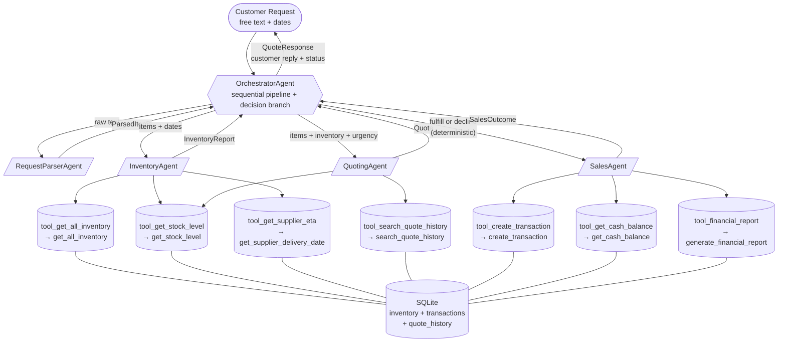

# Beaver's Choice — Multi-Agent Workflow

This diagram shows the agents, their tools (mapped to the helper functions
in `project_starter.py`), and the data flow for a single quote request.



## Agent responsibilities

| Agent | Responsibility | Tools |
|---|---|---|
| **OrchestratorAgent** | Receives the customer request, sequences the four specialists, applies the deterministic fulfill/decline branch, and returns the final `QuoteResponse`. | (delegates to other agents) |
| **RequestParserAgent** | Maps free-text customer language to canonical SKUs and integer quantities (`ParsedItems`). Returns `parse_confidence=0` for unparseable requests. | none — catalog injected into prompt |
| **InventoryAgent** | For each requested SKU computes on-hand stock, shortfall, and supplier ETA if a restock would be needed (`InventoryReport`). | `tool_get_all_inventory`, `tool_get_stock_level`, `tool_get_supplier_eta` |
| **QuotingAgent** | Builds line items with bulk discounts (5/10/15% tiers) and an urgency premium (4 or 8% on tight deadlines), grounded against similar past quotes (`Quote`). | `tool_search_quote_history`, `tool_get_stock_level` |
| **SalesAgent** | Reads cash balance, writes `sale` transactions on fulfilled orders, and produces the customer-facing reply (`SalesOutcome`). | `tool_create_transaction`, `tool_get_cash_balance`, `tool_financial_report` |

## Tool ↔ helper-function mapping (rubric coverage)

| Helper function (`project_starter.py`) | Tool wrapper | Used by agent |
|---|---|---|
| `get_all_inventory` | `tool_get_all_inventory` | Inventory |
| `get_stock_level` | `tool_get_stock_level` | Inventory, Quoting |
| `get_supplier_delivery_date` | `tool_get_supplier_eta` | Inventory |
| `search_quote_history` | `tool_search_quote_history` | Quoting |
| `create_transaction` | `tool_create_transaction` | Sales |
| `get_cash_balance` | `tool_get_cash_balance` | Sales |
| `generate_financial_report` | `tool_financial_report` | Sales |

All seven helper functions are wired into at least one tool used by at
least one agent.

## Decision branch (deterministic, in `agents/orchestrator.py`)

```
if parsed.items is empty           → declined ("could not interpret")
elif deadline < request_date        → declined ("deadline before request_date")
elif any line has shortfall > 0
   and not viable_by_deadline       → declined ("stock won't arrive in time")
elif any line has shortfall > 0
   and     viable_by_deadline       → declined ("restock viable; offer alt timeline")
else                                → fulfilled (write transactions)
```

The decision is computed in plain Python so the eval is reproducible —
the LLM is responsible only for parsing free text, calling tools, and
writing the customer-friendly reply.
