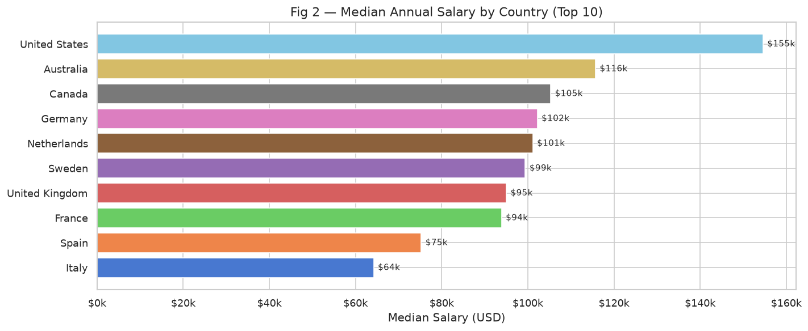
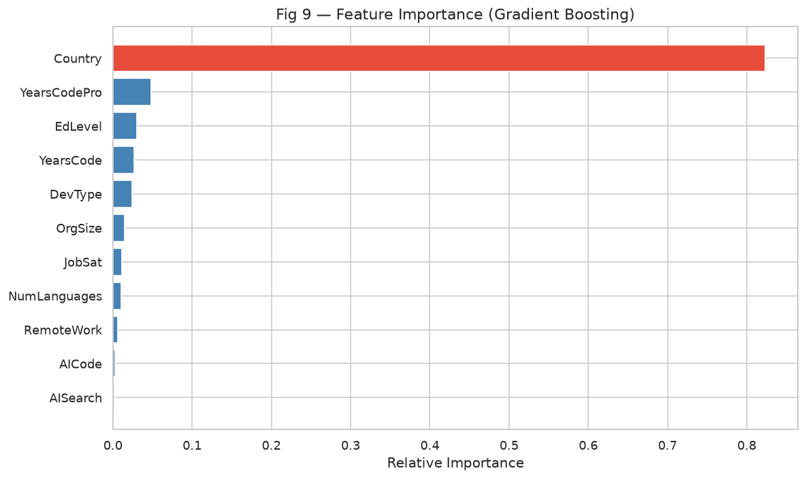
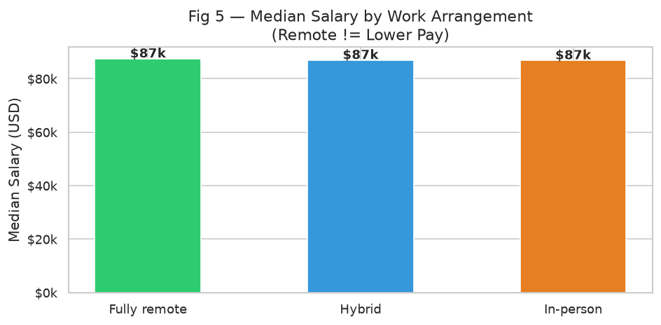
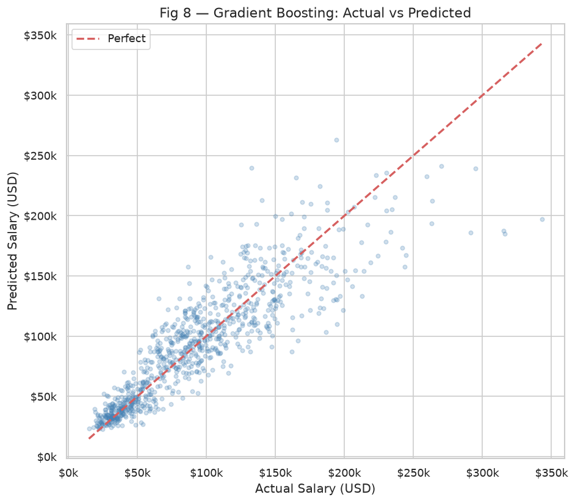
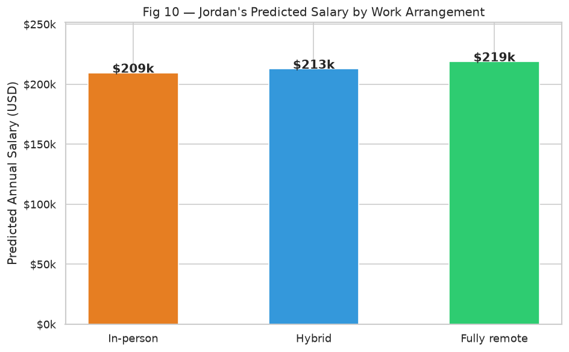

# 💼 What Makes Developers Rich?
## A Data-Driven Look at What Actually Drives Software Salaries in 2024

*Published by Sam Sepassi | June 2026*

---

---

### The Question Everyone's Asking

Should you move to the US? Stay remote? Get a Master's degree? Stack Overflow surveys 
over 65,000 developers every year — and the numbers tell a surprisingly clear story about 
what actually moves the needle on your paycheck.

---

### Q1 — What Features Drive Developer Salary?

The #1 factor is one you already know but maybe don't want to hear: **where you live**.

Country alone accounts for **82% of the salary variance** in the model — dwarfing education, 
experience, and even the type of development work you do. A US-based developer earns a 
median salary roughly **4× higher** than a developer in India with the same skills, 
experience, and education.

After country, the next strongest drivers are:
- **Years of professional experience** (5%) — salary grows steadily up to ~15 years, then plateaus
- **Education level** (3%) — Master's degree holders earn ~10% more than Bachelor's
- **Developer type** (2%) — ML engineers and DevOps/SRE engineers consistently top the charts

Experience matters, but geography matters far more.

---

### Q2 — The Surprising Insight: Remote Workers Earn More

Here's the finding that defies the "remote discount" narrative most people expect:

> **Fully remote developers earn MORE than their in-person counterparts.**

The median salary for fully remote developers is higher than both hybrid and in-person roles. 
But before you assume remote work itself causes higher pay — it doesn't.

The real story is **self-selection**: the developers who successfully negotiated fully remote 
arrangements tend to be senior engineers at US-based companies. They had the leverage to 
demand remote flexibility precisely because they were already high earners. The premium isn't 
caused by remote work — it's caused by who ends up working remotely.

Interestingly, developers who use **AI coding and search tools** also earn slightly more — 
though the gap is modest (~$2,000 median difference), suggesting adoption is now near-universal 
enough that it no longer differentiates.

---

### Q3 — How Accurate is the Model?

We trained three machine learning models on 80% of the data and tested on the remaining 20%:

| Model | R² | MAE |
|---|---|---|
| **Ridge Regression** | **0.87** | **$16,305** |
| Random Forest | 0.85 | $17,311 |
| Gradient Boosting | 0.85 | $17,169 |

The best model (Ridge Regression) explains **87% of salary variance** and is off by an 
average of ~$16,300 per prediction — solid performance given that salary data is inherently 
noisy (self-reported, across wildly different countries and purchasing-power contexts).

The scatter plot shows tight clustering around the perfect-prediction line, with the expected 
wider spread at the high end where salaries are both less common and harder to predict.

---

### Q4 — What Would Jordan Earn Going Remote?

**The scenario:** Jordan is a senior ML Engineer in the US — 12 years professional 
experience, Master's degree, currently in-person at a 1,000+ person company. Jordan is 
weighing whether to negotiate a fully remote arrangement.

The model's prediction:

| Arrangement | Predicted Salary |
|---|---|
| In-person | $209,000 |
| Hybrid | $213,000 |
| Fully remote | $219,000 |

Going fully remote adds a predicted **~$9,400/year premium** for Jordan. At Jordan's 
experience and country level, the model captures that senior US engineers working remotely 
command top-of-market rates.

---

### What It All Means

The data is refreshingly direct: **where you work (geographically) matters far more than 
what you work on or how many degrees you have.** If you're already in a high-cost market 
like the US, remote work can be a salary-positive move — especially for senior engineers 
who have the leverage to negotiate it.

The best career moves, according to the data:
1. Get experience — salary grows meaningfully up to ~15 years
2. Work in a high-paying geography (or work remotely for a company in one)
3. Move toward ML/DevOps/Security roles for top-of-market compensation

---

*Code and full analysis: [github.com/samsepassi1/School](https://github.com/samsepassi1/School)*  
*Data: Stack Overflow Developer Survey 2024 — [survey.stackoverflow.co](https://survey.stackoverflow.co/)*
