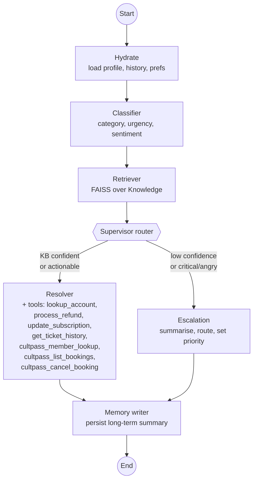

# UDA-Hub — Multi-Agent Architecture

UDA-Hub is a **Universal Decision Agent** that ingests Cult Pass support
tickets, decides how to handle each one, and either resolves it autonomously
or escalates it to a human. The system is built with **LangGraph** (no
prebuilt agent) and follows the **Supervisor** multi-agent pattern.

---

## 1. Topology



ASCII fallback:

```
   START
     |
     v
 +---------+    +-----------+    +----------+
 | hydrate | -> | classifier| -> | retriever|
 +---------+    +-----------+    +----------+
                                       |
                              +--------+--------+
                              |  supervisor     |
                              |  router         |
                              +-----+-----------+
                                    |
                  +-----------------+-----------------+
                  | confident / actionable             | low conf / critical / angry
                  v                                    v
             +----------+                         +-----------+
             | resolver |                         | escalation|
             +----------+                         +-----------+
                  \                                   /
                   \                                 /
                    v                               v
                       +-----------------+
                       |  memory_writer  |
                       +--------+--------+
                                |
                                v
                              END
```

---

## 2. Agents and responsibilities

| Agent             | Responsibilities                                                                                     | Reads                                                         | Writes                                                       | Side effects                                                                |
|-------------------|------------------------------------------------------------------------------------------------------|---------------------------------------------------------------|--------------------------------------------------------------|-----------------------------------------------------------------------------|
| **Hydrate**       | Load `User`/`Account` profile, prior tickets, customer preferences from long-term memory.            | `user_id`, `ticket_id`                                        | `customer_profile`, `customer_history`, `customer_preferences` | Inserts a new `Ticket` row + initial `TicketMessage` if the ticket is new.  |
| **Classifier**    | Produce structured `category / urgency / sentiment / confidence` from the ticket text + history.     | `subject`, `body`, `customer_history`                          | `classification`                                              | Upserts `TicketMetadata`.                                                   |
| **Retriever**     | FAISS similarity search over `Knowledge`; returns top-k articles + best match score.                 | `subject`, `body`                                             | `retrieved`, `retrieval_confidence`                          | None.                                                                       |
| **Supervisor**    | *Conditional edge* deciding the next step. Routes by classification + retrieval confidence + sentiment + actionable verbs. | All of the above                                              | `route`                                                       | None.                                                                       |
| **Resolver**      | Compose the reply using only retrieved articles or tool results. Calls up to 7 tools (4 core + 3 CultPass) in a bounded ReAct loop. | All context + `retrieved`                                     | `answer`, `needs_escalation=False`                            | Tool calls update `Account` (refund, plan) and `CultPassBooking`. Persists a `TicketMessage` per tool + reply, marks ticket `resolved`. |
| **Escalation**    | Summarise for a human handler; choose owner team + priority; produce a customer-facing acknowledgement. | All context                                                    | `answer`, `needs_escalation=True`, `escalation_reason`        | Persists escalation messages, marks ticket `escalated`, attaches structured handoff to `TicketMetadata.extra_json`. |
| **Memory writer** | Persist a compact summary of the resolution / escalation under `("customer", user_id)`.              | `answer`, `classification`, outcome flags                     | (terminal node)                                              | `LongTerm` row.                                                              |

Specialised agents in this system: **Classifier, Retriever, Resolver, Escalation** plus orchestration nodes **Hydrate** and **Memory writer** and the **Supervisor** routing function — six total nodes, four of which are LLM-driven specialists.

---

## 3. State schema

`AgentState` is a `TypedDict` (`agentic/agents/state.py`). LangGraph merges
partial dict updates returned by each node, so each agent only writes the
keys it owns.

```python
class AgentState(TypedDict, total=False):
    # Identity
    ticket_id: str
    user_id: str
    thread_id: str
    # Inbound
    subject: str; body: str; channel: str; urgency_in: str
    # Conversation messages (in-run)
    messages: list[AnyMessage]            # uses LangGraph add_messages reducer
    # Long-term context
    customer_profile: dict
    customer_history: list[dict]
    customer_preferences: dict
    # Filled by classifier / retriever
    classification: Classification
    retrieved: list[RetrievedDoc]
    retrieval_confidence: float
    # Output
    answer: str
    needs_escalation: bool
    escalation_reason: str
    # Audit
    log: list[str]
```

---

## 4. Information flow

1. **Inbound ticket** → JSON dict (`ticket_id`, `user_id`, `subject`, `body`, `channel`, `urgency`, optional `thread_id`).
2. **Hydrate** loads the customer's stored context. New tickets are persisted to SQLite immediately so subsequent steps can append messages.
3. **Classifier** uses an LLM (`gpt-4o-mini`, structured output via Pydantic) to produce `category / urgency / sentiment / confidence`. Persisted to `TicketMetadata`.
4. **Retriever** queries FAISS over the `Knowledge` table; returns the top-4 articles plus a 0..1 cosine-derived confidence. A keyword fallback (no API key needed) keeps the rest of the system exercisable offline.
5. **Supervisor router** evaluates rules in order:
   - `urgency == "critical"` → **escalation**
   - `sentiment == "negative"` AND `confidence < threshold` → **escalation**
   - `confidence < threshold` AND ticket isn't an obvious actionable verb → **escalation**
   - else → **resolver**
6. **Resolver** runs an internal ReAct loop bounded to 3 rounds. The LLM is bound to seven tools (four core + three CultPass-external) with explicit allow/deny rules baked into the docstrings (refund auto-cap, elite-tier upgrades require concierge). Final answer cites article ids inline (e.g. `[cp_kb_002]`).
7. **Escalation** uses structured output to emit a handoff packet (`summary`, `suggested_team`, `priority`, `next_steps`) plus a customer-facing acknowledgement.
8. **Memory writer** stores a compact summary in long-term memory keyed by `("customer", user_id)`.

Every agent appends one or more lines to `state["log"]`, giving a step-by-step audit trail returned in the final state.

---

## 5. Why Supervisor

- Tickets have a deterministic pipeline (classify → retrieve → decide) but
  the branching at the end is genuinely conditional and benefits from a
  single routing point with clear, auditable rules.
- Specialised agents stay small — each is a single LLM call with a focused
  prompt — which is cheap, fast, and easy to evaluate.
- Adding new branches (e.g. a "Concierge" agent for elite-tier customers,
  a "Translation" agent for non-English locales) means adding one node and
  one edge in `agentic/workflow.py`; existing agents are unaffected.

Alternatives considered:

- **Hierarchical** — overkill for the current set of capabilities; would add coordination overhead.
- **Network** — every-agent-talks-to-every-agent makes routing implicit and harder to audit.
- **Single ReAct agent with all tools** — works but loses observability: classification and routing become opaque LLM choices instead of explicit state transitions.
